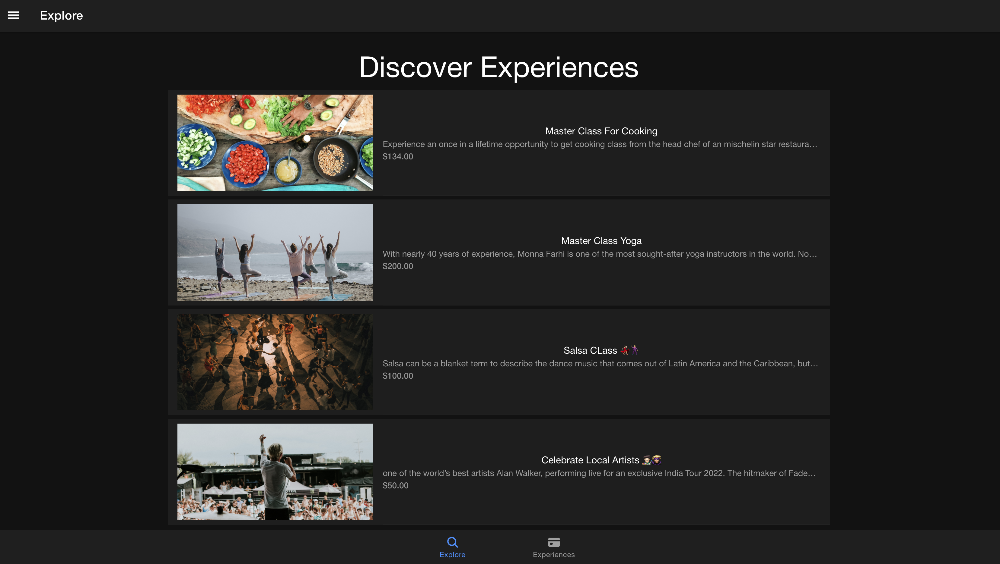

# romeBuddy

 *romeBuddy is an experience booking website* 
 *romeBuddy is hybrid webapp that allows user to book and offer bunch of custom experiences!*
 
_following are the techonlogies used_
 
 * Angular.
 * Ionic.
 * Capacitor.
 * firebase.
 
 
  
 
 _ Steps to use this project_
 
 * Download the repository
 * Type npm install
 * then type:- npm run watch
